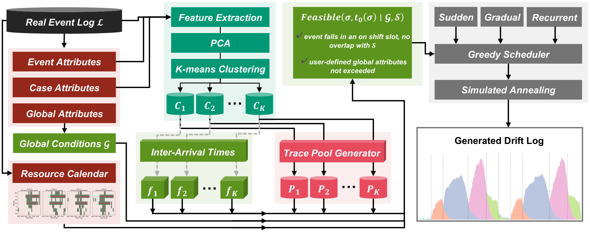

# RealDrift: Multi-Perspective Drift Generation from Real Event Logs

**RealDrift** is a framework for generating synthetic event logs with controllable, multi-perspective concept drift injected directly from a real event log. It clusters a log's own traces into tasks, trains a conditioned decoder to generate a novel trace pool per task, learns each task's arrival distribution and the global conditions that must hold throughout, and composes these into sudden, gradual or recurrent drift via a drift composer, with ground-truth labels recorded directly from the scheduling process.



---

## Repository Structure

```text
RealDrift/
│
├── data/
│   ├── raw/                      # Real event logs (.xes)
│   ├── sublogs/                  # Per-cluster sublogs from trace clustering
│   └── concept_pools/            # Pre-generated trace pools (A/B instances per cluster)
├── external/
│   └── AT-KDE/                   # Vendored, NumPy 2.x patch applied
├── src/
│   ├── step1_attribute_classification.py   # Attribute classification
│   ├── step2_resource_calendars.py         # Resource calendar discovery
│   ├── step3_trace_clustering.py           # Trace clustering
│   ├── step4_trace_pool_generation.py      # TF-decoder wrapper
│   ├── step5_arrival_time_modeling.py      # Arrival modeling, flat-KDE or AT-KDE
│   ├── step6_drift_composer.py             # Feasible() and the drift composer
│   ├── atkde_adapter.py                    # Wrapper around external/AT-KDE/
│   └── io_utils.py                         # Shared CSV loading/export utilities
├── configs/
│   └── bpic2012_config.yaml
├── outputs/                      # Generated logs, ground truth, and figures land here
├── generate_drift_log.py         # Orchestrator, run this to generate a log
├── test_pipeline.ipynb           # Runs and asserts on every step, on real data
├── reproduce_bpic12_paper.ipynb  # Reproduces Figure 4 and the three composition tiers
├── requirements.txt
└── README.md
```

---

## Installation

```bash
python -m venv venv
source venv/bin/activate
pip install -r requirements.txt
```

Requires Python ≥ 3.10. `pix-framework` (case-level attribute classification) requires Python <3.12, on 3.12+ step1 falls back automatically to a reimplementation. Trace pool generation was run on an NVIDIA Tesla V100 (16 GB), clustering, arrival fitting and composition run fine on CPU.

---

## Data Preparation

This repo ships real data and pre-generated intermediate results for BPIC2012, so no retraining is needed to compose a log out of the box, `data/raw/` holds the real log, `data/sublogs/` the per-cluster sublogs, and `data/concept_pools/` the pre-generated trace pools. Sepsis follows the same layout once its sublogs and concept pools are added under `data/`. The TF-decoder is only needed to regenerate the concept pools from scratch.

---

## How to Run?

### Basic run (recurrent tier, full scale)

```bash
python generate_drift_log.py \
    --config configs/bpic2012_config.yaml \
    --tier recurrent \
    --seed 0
```

### Sudden or gradual tier

```bash
python generate_drift_log.py \
    --config configs/bpic2012_config.yaml \
    --tier gradual \
    --gradual-window 30
```

### Fast sanity check before a full run

```bash
python generate_drift_log.py \
    --config configs/bpic2012_config.yaml \
    --skip-sa --max-cases-per-instance 400
```

---

## Arguments

| Argument | Default | Description |
|---|---|---|
| `--config` | required | Dataset config YAML |
| `--tier` | `recurrent` | `sudden`, `gradual`, or `recurrent` |
| `--calendars` | none | Pickle from `step2_resource_calendars.to_composer_calendars`, adds resource-based feasibility |
| `--max-beds` | none | Optional global bed-capacity condition |
| `--skip-sa` | off | Skip simulated annealing, greedy pass only |
| `--sa-iterations` | `2000` | Simulated-annealing iteration count |
| `--gradual-window` | `30` | Blend window *w* for gradual transitions |
| `--seed` | `0` | Random seed |
| `--out-dir` | `outputs` | Output directory |
| `--max-cases-per-instance` | none | Truncate pools for a fast sanity check |

Output lands in `outputs/`, the composed log (`*_drift_log.csv`), ground-truth transitions (`*_transitions.csv`), and, if any cases couldn't be scheduled, `*_excluded.csv`.

---

## Reproducing the Paper

```bash
jupyter nbconvert --to notebook --execute --inplace reproduce_bpic12_paper.ipynb
jupyter nbconvert --to notebook --execute --inplace test_pipeline.ipynb
```

Both take a few minutes to run top to bottom. The first reproduces Figure 4 (clustering) and the recurrent/sudden/gradual composition tiers, the second runs and asserts on every pipeline step against real data.

---

## External Repositories

| Repository | Used for | Required? |
|---|---|---|
| [pix-framework](https://github.com/AutomatedProcessImprovement/pix-framework) | Case-level attribute discovery | No, Python <3.12 only, else falls back |
| [AT-KDE](https://github.com/konradoezdemir/AT-KDE) | Arrival modeling | No, flat-KDE is the default |
| TF-decoder (Perdikogiannis et al., BPM, to appear) | Trace pool generation | No, only to regenerate `data/concept_pools/` |
| [PELT](https://github.com/niklasadams/explainable_concept_drift_pm) (PELT) | Drift detection baseline | Only for reproducing Table 3 |
| [Version Clustering (VC)](https://gitlab.cs.univie.ac.at/bernolda00cs/version-clustering-cdd) (VC) | Drift detection baseline | Only for reproducing Table 3 |
| [COMPASS](https://github.com/SvStraten/COMPASS) | Continual learning baseline | Only for reproducing Figure 5 |

None of the last three are called by this repo, they consume its output as their own input. AT-KDE setup:

```bash
git clone https://github.com/konradoezdemir/AT-KDE.git external/AT-KDE
pip install KDEpy
```

Already patched for NumPy 2.x in the vendored copy, if you clone fresh, replace `np.infty` with `np.inf` in `source/iat_approaches/kde.py` and `diagnostics/eval_event_logs.py`.